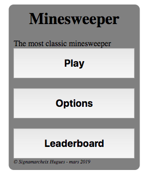
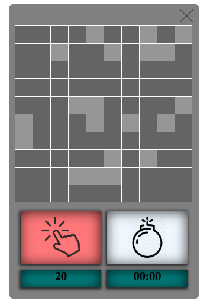
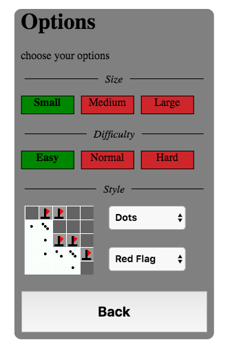

## Project overview

This is a browser reproduction of the famous game Minesweeper. It comes with an options page
This project was made with the use of the P5js library.

## How to make it work

Open `index.html` to view it in the browser.
You can also launch it with `php -S 127.0.0.1:8080` and then navigate to localhost:8080 in the browser.

## Features

### Game 

`Basic mechanics` : Everybody knows the rules of Minesweeper. I won't insult you re-explaining them here.

### Options

`Set the grid's size` : You can choose the grid's size between 3 sizes : small (10x10) , medium (20x20), large (30x30)

`Set the grid's difficulty` : You can choose the difficulty, ie the number of mines within your grid.

`Set the grid's style`: You can select the style for your tiles and your flags

